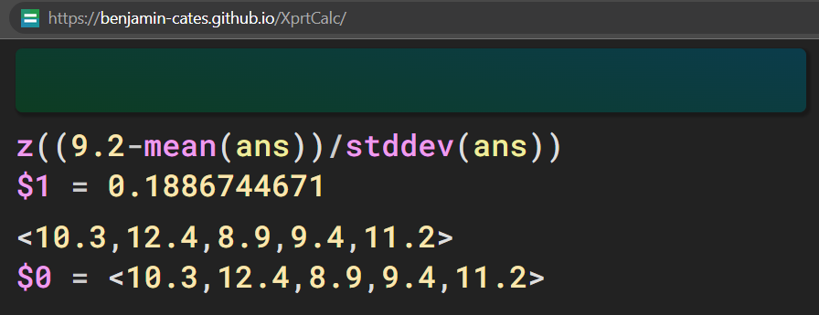

# XprtCalc
Note: project is currently hosted at [benjamin-cates.github.io](https://benjamin-cates.github.io/XprtCalc).

XprtCalc (pronounced expert calc) is an string based calculator for advanced experssions. It supports: vectors, lambda functions, arbitrary-precision, and every common math function. XprtCalc parses text to a tree-like object, which can then be computed, derived, simplified, or manipulated in many other ways.

Value types:
- Number (complex float with unit, e.g. `4+2i*[kg]`)
- Complex arbitrary-precision float (with unit)
- Vectors (many functions like add and sqrt apply to vectors)
- Lambda functions
- Strings (similar to JS)
- Key-value maps (similar to JS)

Features:
- Wide array of built-in functions
    - All elementary math functions
    - Trig functions
    - Integer functions like factor and round
    - Factorial and gamma
    - Comparison
    - Bitwise integer operations
    - Random numbers
    - Arbitrary precision and regular constants
    - Repeated sum and infinite sum
    - Derivative and simplify
    - Numerical integration
    - Vector mapping functions (most array methods in JS)
    - String evaluation
- Includeable library functions
    - Statistics functions
    - Quadratic formula
    - Complex formulas
- Metric units (including multiplication and division interaction)
- Variable declarations and indexed assignment
- History

In addition to utility features, it also has quality of life features:
- Syntax highlighting
- Virtual on-screen keyboard
- Help pages

XprtCalc is currently in beta development. It is mainly written in C++ as a command line program, but is also compiled to WebAssembly and can be accessed at the link above in a web app.

Example usage:

This is an example of a user finding the area to the left of a z-score, given a certain data set. They used the included functions `mean`, `z`, and `stddev` to calculate the area under the z curve to the left of `9.2` to be `0.189` for that data set.

## Contributions
This project is under the [MIT License](docs/LICENSE), and the [compiling guide](build/compiling.md) will assist you in setting up the project if you would like to edit the command line version.